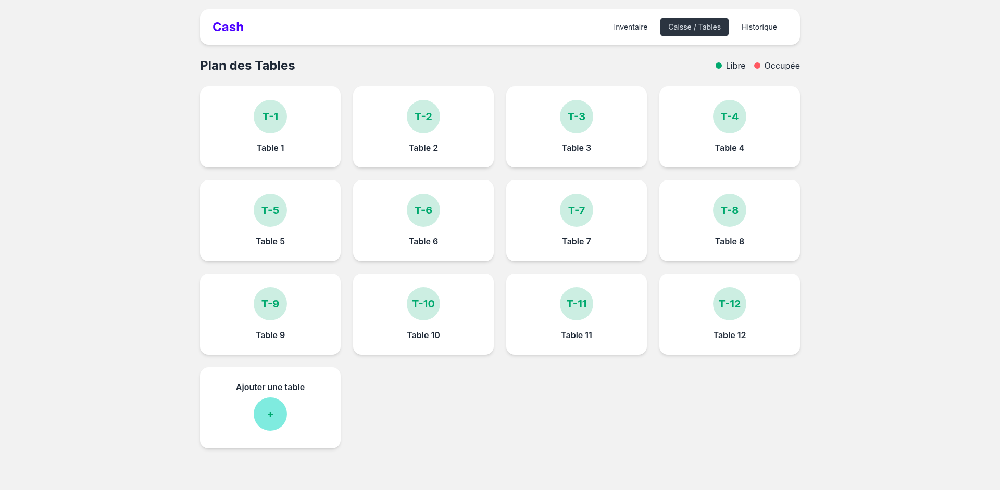
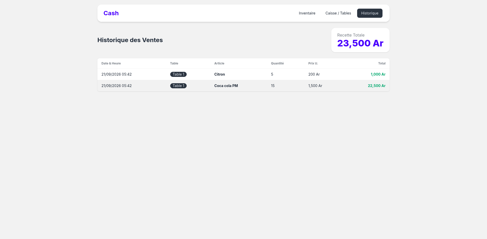

# Barman - Application web de caisse de bar
    Version 0.1

Cet application permet de gérer la caisse d'un bar de façon générale.
On y trouve actuelement 3 pages:

## Captures d'ecrans
### Inventaire

### Plan de tables

### Historique des ventes

## Lien de la démo:
Démonstration disponible en suivant ce lien

    https://barman-jklh.onrender.com

Copiez le et collez le sur la barre de navigation de votre navigateur. 

**NB** : La base de données est encore éphémère, donc elle sera réinitialisé à chaque session.